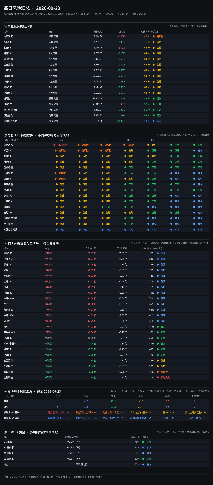

# 每日风险汇总 · 2026-09-23

> 风险口径：`🔵 冰点<20 · 🟦 偏冷<40 · 🟢 正常<60 · 🟡 偏热<80 · 🟠 高风险<90 · 🔴 极端风险≥90`，分位数(0~1)乘 100 后套同一张表。

## ① 宽基指数风险总览

| 指数 | 分类 | 最新点位 | 涨跌幅 | 过热评分 | 风险等级 |
|---|---|---:|---:|---:|---|
| 纳斯达克 | 美股宽基 | 27,244.28 | +0.45% | 86 | 🟠 高风险 |
| 标普500 | 美股宽基 | 7,764.64 | -0.00% | 76 | 🟡 偏热 |
| 北证50 | A股宽基 | 1,074.04 | +2.60% | 65 | 🟡 偏热 |
| 科创50 | A股宽基 | 1,660.85 | -0.25% | 64 | 🟡 偏热 |
| 创业板指 | A股宽基 | 3,379.61 | -0.60% | 64 | 🟡 偏热 |
| 上证指数 | A股宽基 | 3,936.52 | -0.39% | 63 | 🟡 偏热 |
| 上证50 | A股宽基 | 2,883.77 | -0.53% | 63 | 🟡 偏热 |
| 深证成指 | A股宽基 | 13,636.07 | -0.64% | 63 | 🟡 偏热 |
| 中证500 | A股宽基 | 7,791.82 | -0.47% | 63 | 🟡 偏热 |
| 沪深300 | A股宽基 | 4,517.28 | -0.60% | 63 | 🟡 偏热 |
| 上证收益 | A股宽基 | 9,660.64 | -0.55% | 62 | 🟡 偏热 |
| 道琼斯 | 美股宽基 | 51,863.69 | -0.36% | 58 | 🟢 正常 |
| 日经225 | 外盘宽基 | 65,018.95 | +1.38% | 56 | 🟢 正常 |
| 恒生科技指数 | 港股宽基 | 4,379.07 | -1.33% | 50 | 🟢 正常 |
| 恒生指数 | 港股宽基 | 24,834.12 | -1.01% | 44 | 🟢 正常 |
| 韩国综合指数 | 外盘宽基 | 0.00 | -100.00% | 10 | 🔵 冰点 |

## ② 宽基 T+1 情景模拟（不同涨跌幅对应的风险）

| 指数 \ 明日涨跌 | +3% | +2% | +1% | +0% | -1% | -2% | -3% |
|---|---|---|---|---|---|---|---|
| 纳斯达克 | 🔴 极端风险 94 | 🟠 高风险 88 | 🟠 高风险 87 | 🟠 高风险 80 | 🟡 偏热 70 | 🟢 正常 43 | 🟢 正常 43 |
| 标普500 | 🟠 高风险 82 | 🟠 高风险 82 | 🟠 高风险 81 | 🟡 偏热 71 | 🟢 正常 50 | 🟢 正常 43 | 🟦 偏冷 29 |
| 北证50 | 🟡 偏热 78 | 🟡 偏热 71 | 🟡 偏热 66 | 🟡 偏热 65 | 🟡 偏热 64 | 🟢 正常 42 | 🟢 正常 42 |
| 科创50 | 🟡 偏热 77 | 🟡 偏热 76 | 🟡 偏热 64 | 🟡 偏热 64 | 🟢 正常 50 | 🟢 正常 50 | 🟢 正常 44 |
| 创业板指 | 🟡 偏热 78 | 🟡 偏热 76 | 🟡 偏热 64 | 🟢 正常 50 | 🟢 正常 50 | 🟢 正常 44 | 🟢 正常 44 |
| 上证指数 | 🟠 高风险 81 | 🟡 偏热 80 | 🟡 偏热 70 | 🟢 正常 50 | 🟢 正常 44 | 🟦 偏冷 30 | 🟦 偏冷 27 |
| 上证50 | 🟠 高风险 81 | 🟡 偏热 71 | 🟡 偏热 64 | 🟡 偏热 62 | 🟢 正常 42 | 🟦 偏冷 28 | 🟦 偏冷 20 |
| 深证成指 | 🟡 偏热 77 | 🟡 偏热 70 | 🟡 偏热 64 | 🟢 正常 50 | 🟢 正常 44 | 🟢 正常 44 | 🟦 偏冷 30 |
| 中证500 | 🟡 偏热 79 | 🟡 偏热 76 | 🟡 偏热 64 | 🟢 正常 50 | 🟢 正常 44 | 🟢 正常 44 | 🟢 正常 44 |
| 沪深300 | 🟡 偏热 78 | 🟡 偏热 70 | 🟡 偏热 64 | 🟢 正常 50 | 🟢 正常 44 | 🟦 偏冷 30 | 🟦 偏冷 27 |
| 上证收益 | 🟡 偏热 80 | 🟡 偏热 70 | 🟡 偏热 64 | 🟢 正常 50 | 🟢 正常 44 | 🟦 偏冷 29 | 🟦 偏冷 20 |
| 道琼斯 | 🟡 偏热 63 | 🟡 偏热 63 | 🟢 正常 57 | 🟢 正常 57 | 🟦 偏冷 36 | 🟦 偏冷 28 | 🟦 偏冷 21 |
| 日经225 | 🟡 偏热 75 | 🟡 偏热 63 | 🟡 偏热 63 | 🟡 偏热 62 | 🟢 正常 56 | 🟢 正常 44 | 🟦 偏冷 37 |
| 恒生科技指数 | 🟡 偏热 64 | 🟡 偏热 64 | 🟡 偏热 63 | 🟢 正常 44 | 🟦 偏冷 38 | 🟦 偏冷 38 | 🟦 偏冷 32 |
| 恒生指数 | 🟡 偏热 69 | 🟡 偏热 63 | 🟡 偏热 63 | 🟢 正常 44 | 🟦 偏冷 38 | 🟦 偏冷 23 | 🟦 偏冷 21 |
| 韩国综合指数 | 🔵 冰点 4 | 🔵 冰点 4 | 🔵 冰点 4 | 🔵 冰点 4 | 🔵 冰点 4 | 🔵 冰点 4 | 🔵 冰点 4 |

## ③ ETF 分板块资金流信号（仅合并板块，截至 2026-09-23）

> 分位为**带方向**的滚动分位：越接近 100% = 放量净申购（资金进场，偏机会），越接近 0% = 放量净赎回（资金撤退，偏风险）。

| 板块 | 方向 | 当日净申赎(亿元) | 近5日(亿元) | 净申赎分位 | 资金信号 |
|---|---|---:|---:|---:|---|
| 沪深300 | 净申购 | +38.57 | +51.07 | 92% | 🔵 冰点 |
| 中概互联 | 净申购 | +0.77 | +1.55 | 84% | 🔵 冰点 |
| 深证100 | 净申购 | +0.29 | -0.83 | 79% | 🟦 偏冷 |
| 光伏 | 净申购 | +0.02 | -0.09 | 76% | 🟦 偏冷 |
| 金融地产 | 净申购 | +0.03 | -0.03 | 73% | 🟦 偏冷 |
| 上证180 | 净申购 | +0.02 | +0.06 | 71% | 🟦 偏冷 |
| 钢铁 | 净申购 | +0.05 | -0.14 | 71% | 🟦 偏冷 |
| 中证500 | 净申购 | +6.17 | +9.96 | 70% | 🟦 偏冷 |
| 中证A500 | 净申购 | +0.04 | +0.04 | 70% | 🟦 偏冷 |
| 军工 | 净申购 | +0.08 | +0.83 | 65% | 🟦 偏冷 |
| 有色金属 | 净申购 | +0.33 | -0.69 | 64% | 🟦 偏冷 |
| 中证1000 | 净申购 | +4.09 | +7.80 | 61% | 🟦 偏冷 |
| 创业板 | 净申购 | +2.75 | -23.96 | 61% | 🟦 偏冷 |
| 汽车 | 净申购 | +0.01 | -0.00 | 57% | 🟢 正常 |
| 芯片半导体 | 净申购 | +0.06 | -2.18 | 57% | 🟢 正常 |
| 中证800 | 净赎回 | +0.00 | -0.51 | 56% | 🟢 正常 |
| MSCI中国A50 | 净赎回 | -0.05 | -0.19 | 50% | 🟢 正常 |
| 科创50 | 净赎回 | -1.31 | -7.72 | 49% | 🟢 正常 |
| 上证50 | 净赎回 | -2.89 | -6.51 | 47% | 🟢 正常 |
| 食品饮料 | 净赎回 | -0.38 | -1.72 | 39% | 🟡 偏热 |
| 医药医疗 | 净赎回 | -0.84 | -8.03 | 37% | 🟡 偏热 |
| 畜牧养殖 | 净赎回 | -0.29 | +1.88 | 17% | 🟠 高风险 |
| 金融科技 | 净赎回 | -1.38 | -0.90 | 1% | 🔴 极端风险 |

## ④ 板块基金风险汇总（截至 2026-09-23）

| 类型 / 排行 | 🔵 冰点 | 🟦 偏冷 | 🟢 正常 | 🟡 偏热 | 🟠 高风险 | 🔴 极端风险 |
|---|:---:|:---:|:---:|:---:|:---:|:---:|
| **自选** | 1 只 | 4 只 | 11 只 | 7 只 | 2 只 | 1 只 |
| **板块** | 0 只 | 2 只 | 27 只 | 21 只 | 0 只 | 0 只 |
| **最热 Top6（名次 →）** | 1. 嘉实全球产业升级股票发起式(QDII)C 91 | 2. 国富亚洲机会股票(QDII)C 84 | 3. 建信新兴市场混合(QDII)C 84 | 4. 易方达全球成长精选混合(QDII)人民币C 78 | 5. 医疗ETF 77 | 6. 天弘全球高端制造混合(QDII)C 76 |
| **最冷 Top6（名次 →）** | 1. 永赢中证沪深港黄金产业股票ETF发起联接C 19 | 2. 信澳产业优选一年持有混合C 24 | 3. 前海开源金银珠宝混合C 25 | 4. 泰信发展主题混合 29 | 5. 基建ETF 36 | 6. 银行ETF 36 |

> **自选** 共 26 只，平均 54 分 🟢 正常；**板块** 共 50 只，平均 54 分 🟢 正常。第一行是六档的只数分布；后两行按名次从左到右排，格子落在哪一列只表示名次，与该列的档位无关。

## ⑤ COMEX 黄金 · 多周期均线斜率风险

最新价：4,326.5 美元 · 2026-09-23

| 周期 | 均线斜率 | 方向 | 斜率分位 | 风险等级 |
|---|---:|---|---:|---|
| 5 日 | +4.820 | 上行 | 49% | 🟢 正常 |
| 20 日 | -16.065 | 下行 | 13% | 🔵 冰点 |
| 30 日 | -4.737 | 下行 | 34% | 🟦 偏冷 |
| 60 日 | +4.707 | 上行 | 51% | 🟢 正常 |
| 综合 | -- | 四周期均值 | 37% | 🟦 偏冷 |

---
生成时间 2026-09-24 03:09　数据源 AKShare。
本页为技术观察，不构成任何投资建议。