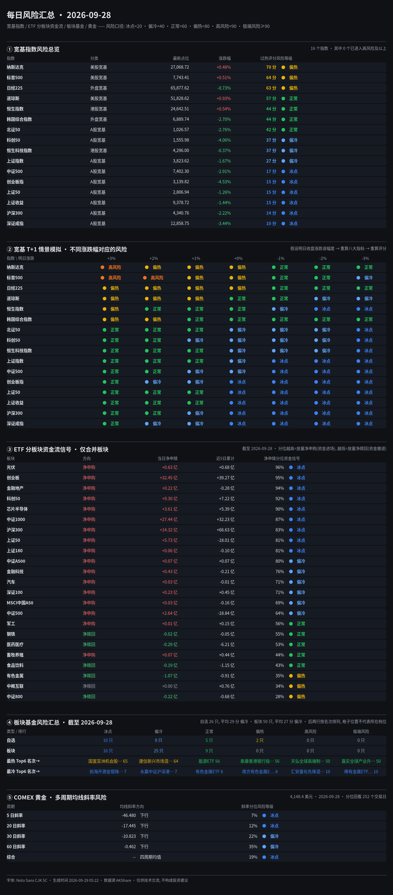

# 每日风险汇总 · 2026-10-09

> 风险口径：`🔵 冰点<20 · 🟦 偏冷<40 · 🟢 正常<60 · 🟡 偏热<80 · 🟠 高风险<90 · 🔴 极端风险≥90`，分位数(0~1)乘 100 后套同一张表。

## ① 宽基指数风险总览

| 指数 | 分类 | 最新点位 | 涨跌幅 | 过热评分 | 风险等级 |
|---|---|---:|---:|---:|---|
| 北证50 | A股宽基 | 1,037.31 | +2.49% | 56 | 🟢 正常 |
| 恒生指数 | 港股宽基 | 24,211.35 | +1.79% | 56 | 🟢 正常 |
| 恒生科技指数 | 港股宽基 | 4,197.84 | +3.06% | 56 | 🟢 正常 |
| 日经225 | 外盘宽基 | 69,030.92 | -0.02% | 50 | 🟢 正常 |
| 道琼斯 | 美股宽基 | 51,231.64 | +0.10% | 44 | 🟢 正常 |
| 纳斯达克 | 美股宽基 | 27,193.34 | -1.25% | 43 | 🟢 正常 |
| 标普500 | 美股宽基 | 7,765.36 | -0.47% | 42 | 🟢 正常 |
| 上证收益 | A股宽基 | 9,382.31 | +0.10% | 35 | 🟦 偏冷 |
| 上证50 | A股宽基 | 2,807.45 | +0.08% | 35 | 🟦 偏冷 |
| 上证指数 | A股宽基 | 3,813.79 | +0.05% | 29 | 🟦 偏冷 |
| 韩国综合指数 | 外盘宽基 | 6,625.93 | -2.62% | 23 | 🟦 偏冷 |
| 沪深300 | A股宽基 | 4,317.26 | +0.16% | 23 | 🟦 偏冷 |
| 中证500 | A股宽基 | 7,251.01 | +0.04% | 21 | 🟦 偏冷 |
| 创业板指 | A股宽基 | 3,043.34 | +0.22% | 16 | 🔵 冰点 |
| 深证成指 | A股宽基 | 12,641.86 | +0.17% | 16 | 🔵 冰点 |
| 科创50 | A股宽基 | 1,457.27 | +0.06% | 15 | 🔵 冰点 |

## ② 宽基 T+1 情景模拟（不同涨跌幅对应的风险）

| 指数 \ 明日涨跌 | +3% | +2% | +1% | +0% | -1% | -2% | -3% |
|---|---|---|---|---|---|---|---|
| 北证50 | 🟡 偏热 62 | 🟢 正常 56 | 🟢 正常 56 | 🟢 正常 56 | 🟢 正常 44 | 🟦 偏冷 38 | 🟦 偏冷 31 |
| 恒生指数 | 🟡 偏热 63 | 🟡 偏热 62 | 🟢 正常 56 | 🟢 正常 57 | 🟢 正常 42 | 🟦 偏冷 29 | 🟦 偏冷 21 |
| 恒生科技指数 | 🟡 偏热 62 | 🟡 偏热 62 | 🟢 正常 56 | 🟢 正常 56 | 🟢 正常 44 | 🟦 偏冷 38 | 🟦 偏冷 24 |
| 日经225 | 🟡 偏热 70 | 🟡 偏热 64 | 🟡 偏热 64 | 🟢 正常 50 | 🟢 正常 42 | 🟢 正常 42 | 🟢 正常 42 |
| 道琼斯 | 🟡 偏热 78 | 🟡 偏热 75 | 🟡 偏热 63 | 🟢 正常 44 | 🟦 偏冷 37 | 🟦 偏冷 23 | 🟦 偏冷 22 |
| 纳斯达克 | 🟡 偏热 78 | 🟡 偏热 69 | 🟢 正常 57 | 🟢 正常 43 | 🟢 正常 43 | 🟢 正常 43 | 🟦 偏冷 37 |
| 标普500 | 🟠 高风险 81 | 🟠 高风险 80 | 🟡 偏热 77 | 🟢 正常 42 | 🟢 正常 43 | 🟦 偏冷 36 | 🟦 偏冷 27 |
| 上证收益 | 🟢 正常 58 | 🟢 正常 57 | 🟢 正常 58 | 🟦 偏冷 35 | 🟦 偏冷 22 | 🟦 偏冷 20 | 🔵 冰点 14 |
| 上证50 | 🟢 正常 57 | 🟢 正常 56 | 🟢 正常 57 | 🟦 偏冷 36 | 🟦 偏冷 22 | 🟦 偏冷 20 | 🔵 冰点 14 |
| 上证指数 | 🟢 正常 58 | 🟢 正常 58 | 🟢 正常 50 | 🟦 偏冷 35 | 🟦 偏冷 21 | 🔵 冰点 20 | 🔵 冰点 13 |
| 韩国综合指数 | 🟢 正常 44 | 🟦 偏冷 38 | 🟦 偏冷 31 | 🟦 偏冷 30 | 🟦 偏冷 22 | 🔵 冰点 13 | 🔵 冰点 12 |
| 沪深300 | 🟢 正常 58 | 🟢 正常 58 | 🟢 正常 50 | 🟦 偏冷 35 | 🔵 冰点 16 | 🔵 冰点 14 | 🔵 冰点 14 |
| 中证500 | 🟢 正常 58 | 🟢 正常 50 | 🟦 偏冷 35 | 🟦 偏冷 22 | 🟦 偏冷 21 | 🔵 冰点 20 | 🔵 冰点 13 |
| 创业板指 | 🟢 正常 50 | 🟢 正常 50 | 🟦 偏冷 35 | 🔵 冰点 16 | 🔵 冰点 15 | 🔵 冰点 14 | 🔵 冰点 14 |
| 深证成指 | 🟢 正常 58 | 🟢 正常 50 | 🟢 正常 50 | 🔵 冰点 17 | 🔵 冰点 16 | 🔵 冰点 14 | 🔵 冰点 14 |
| 科创50 | 🟦 偏冷 35 | 🟦 偏冷 29 | 🟦 偏冷 23 | 🟦 偏冷 22 | 🟦 偏冷 21 | 🔵 冰点 14 | 🔵 冰点 13 |

## ③ ETF 分板块资金流信号（仅合并板块，截至 2026-10-09）

> 分位为**带方向**的滚动分位：越接近 100% = 放量净申购（资金进场，偏机会），越接近 0% = 放量净赎回（资金撤退，偏风险）。

| 板块 | 方向 | 当日净申赎(亿元) | 近5日(亿元) | 净申赎分位 | 资金信号 |
|---|---|---:|---:|---:|---|
| 军工 | 净申购 | +1.53 | +1.64 | 96% | 🔵 冰点 |
| 汽车 | 净申购 | +0.14 | +0.15 | 96% | 🔵 冰点 |
| 创业板 | 净申购 | +25.85 | +54.07 | 92% | 🔵 冰点 |
| 科创50 | 净申购 | +8.65 | +31.46 | 90% | 🔵 冰点 |
| 芯片半导体 | 净申购 | +3.49 | +7.74 | 87% | 🔵 冰点 |
| 沪深300 | 净申购 | +19.17 | +50.52 | 86% | 🔵 冰点 |
| 中证1000 | 净申购 | +26.50 | +62.17 | 85% | 🔵 冰点 |
| 中证500 | 净申购 | +14.77 | +25.20 | 84% | 🔵 冰点 |
| 有色金属 | 净申购 | +2.23 | -0.77 | 84% | 🔵 冰点 |
| 钢铁 | 净申购 | +0.12 | +0.51 | 81% | 🔵 冰点 |
| 上证50 | 净申购 | +5.47 | -1.27 | 78% | 🟦 偏冷 |
| 医药医疗 | 净申购 | +0.84 | -3.45 | 77% | 🟦 偏冷 |
| 金融科技 | 净申购 | +0.40 | +1.00 | 75% | 🟦 偏冷 |
| 光伏 | 净赎回 | -0.02 | +0.49 | 72% | 🟦 偏冷 |
| 上证180 | 净申购 | +0.02 | +0.13 | 69% | 🟦 偏冷 |
| 深证100 | 净申购 | +0.18 | +0.64 | 65% | 🟦 偏冷 |
| MSCI中国A50 | 净赎回 | +0.00 | -0.00 | 61% | 🟦 偏冷 |
| 中概互联 | 净申购 | +0.01 | +0.48 | 58% | 🟢 正常 |
| 食品饮料 | 净申购 | +0.07 | -0.67 | 58% | 🟢 正常 |
| 中证800 | 净赎回 | +0.00 | -0.44 | 55% | 🟢 正常 |
| 金融地产 | 净赎回 | -0.07 | +0.04 | 48% | 🟢 正常 |
| 畜牧养殖 | 净赎回 | -0.06 | -0.10 | 36% | 🟡 偏热 |
| 中证A500 | 净赎回 | -0.07 | +0.07 | 25% | 🟡 偏热 |

## ④ 板块基金风险汇总（截至 2026-10-09）

| 类型 / 排行 | 🔵 冰点 | 🟦 偏冷 | 🟢 正常 | 🟡 偏热 | 🟠 高风险 | 🔴 极端风险 |
|---|:---:|:---:|:---:|:---:|:---:|:---:|
| **板块** | 12 只 | 8 只 | 22 只 | 8 只 | 0 只 | 0 只 |
| **自选** | 11 只 | 6 只 | 8 只 | 1 只 | 0 只 | 0 只 |
| **最热 Top6（名次 →）** | 1. 中证红利ETF 64 | 2. 酒ETF 64 | 3. 消费ETF 64 | 4. 红利ETF 64 | 5. 信澳产业优选一年持有混合C 64 | 6. 能源ETF 64 |
| **最冷 Top6（名次 →）** | 1. 汇添富科技领先混合C 6 | 2. 财通集成电路产业股票C 6 | 3. 5GETF 6 | 4. 华泰柏瑞质量成长C 7 | 5. 国联安优选行业混合A 7 | 6. 创成长ETF 8 |

> **板块** 共 50 只，平均 42 分 🟢 正常；**自选** 共 26 只，平均 30 分 🟦 偏冷。第一行是六档的只数分布；后两行按名次从左到右排，格子落在哪一列只表示名次，与该列的档位无关。

## ⑤ COMEX 黄金 · 多周期均线斜率风险

最新价：4,215.1 美元 · 2026-10-09

| 周期 | 均线斜率 | 方向 | 斜率分位 | 风险等级 |
|---|---:|---|---:|---|
| 5 日 | +8.680 | 上行 | 59% | 🟢 正常 |
| 20 日 | -8.745 | 下行 | 28% | 🟦 偏冷 |
| 30 日 | -9.623 | 下行 | 27% | 🟦 偏冷 |
| 60 日 | +3.207 | 上行 | 51% | 🟢 正常 |
| 综合 | -- | 四周期均值 | 41% | 🟢 正常 |

---
生成时间 2026-10-10 00:09　数据源 AKShare。
本页为技术观察，不构成任何投资建议。